## Desafio para o processo seletivo SHARENERGY 2023/01

Repositório com a resolução do desafio do processo seletivo da SHARENERGY 2023/01 por Erik Yamamoto.
 

- Vídeo explicativo: https://youtu.be/j5326l7cdCM

## O Projeto

  
<strong>Descrição</strong>

  O projeto consiste em uma aplicação web com diversas funcionalidades, as quais serão apresentadas na descrição de cada página. A aplicação foi desenvolvida com front-end, back-end e banco de dados, como mostra o esquema abaixo.

  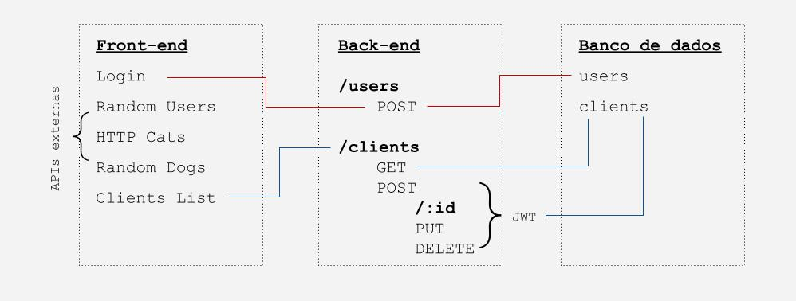

  O front-end faz requisições para APIs desenvolvidas exclusivamente para o projeto e também para APIs externas. A estilização foi feita de maneira responsiva. O back-end utilizou a arquitetura MSC(Model Service Controller). E, por fim, o banco de dados foi criado com 2 coleções, uma para conferir usuário e senha, e outra para os clientes.
  Como complemento, foram feitos testes de integração para o back-end. Além disso, cabe destacar que a ideia para o front-end foi realizada com o desenvolvimento de um [rascunho no Figma](https://www.figma.com/file/7ZU6ZBxlAD5gpiLxkopvj7/Sharenergy?node-id=0%3A1&t=VpuZfkhsKWJxlET7-1)

### Páginas

  
<strong>Login</strong>

  A tela de Login é a porta inicial da aplicação, caso o usuário não esteja logado, ele é direcionado automaticamente para essa tela. Ao clicar no botão de Login, é feita uma requisição para o backend que confere a se senha encriptografado no banco de dados está correta, caso sim, um token é gerado com o JWT.
  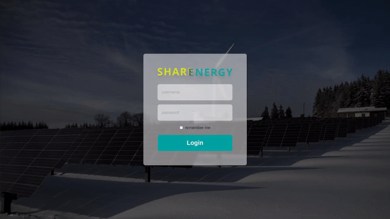
   
  Versão mobile:
   
  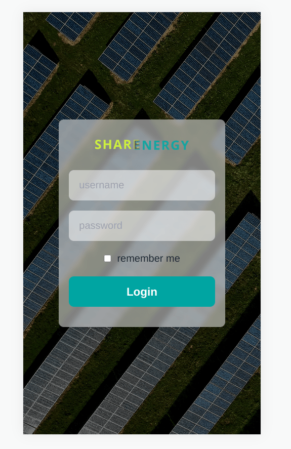
   
  O background da tela de Login é aleatório e pode mudar a cada acesso.
  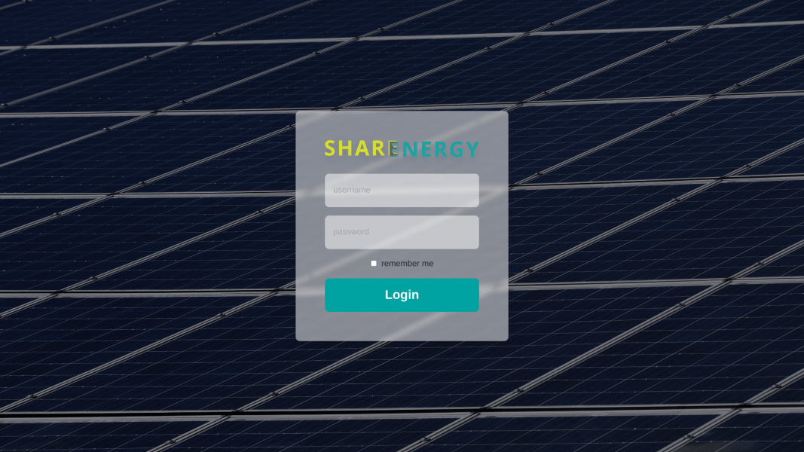
  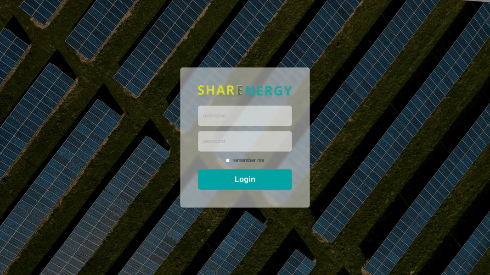

  
<strong>Random Users</strong>

  Nessa página é feita uma requisição para uma [API externa de usuários aleatórios](https://randomuser.me/), é possível buscar por informações do usuário e procurar mais usuários ao navegar pelas páginas. Para que seja possível voltar para os mesmos usuários numa mesma navegação, o 'seed' da API é armazenado enquanto a página não é recarregada.

  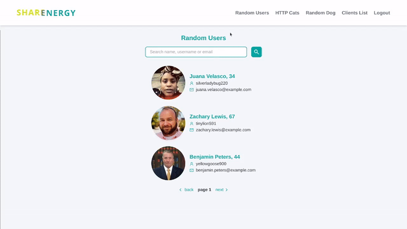
   
  Versão mobile:
   
  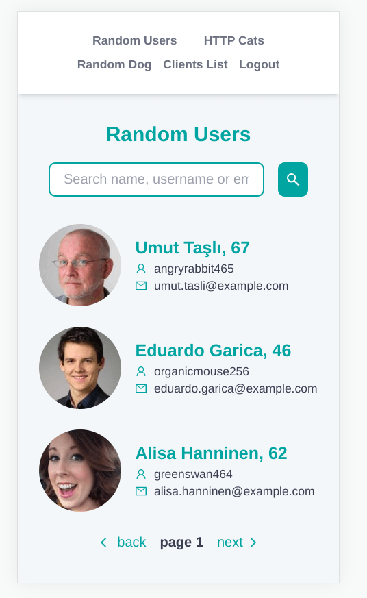
   

  
<strong>HTTP Cats</strong>

  Em HTTP Cats, é possível buscar por um código HTTP e, caso ele exista, a API externa [HTTP Cat](https://http.cat/) retorna uma imagem relacionada, caso não, retorna uma imagem representando o código 404.

  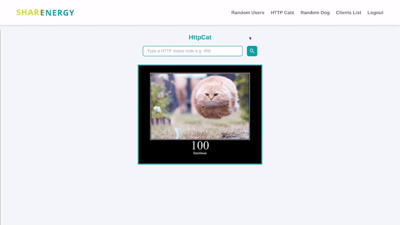
   
  Versão mobile:
   
  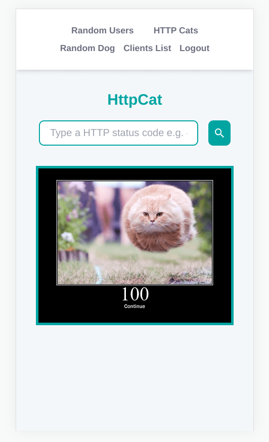
   

  
<strong>Random Dogs</strong>

  Nessa página é feita uma requisição para uma [API externa de imagens de cachorros aleatórios](https://random.dog/), ao atualizar a página, um novo cachorro é retornado.

  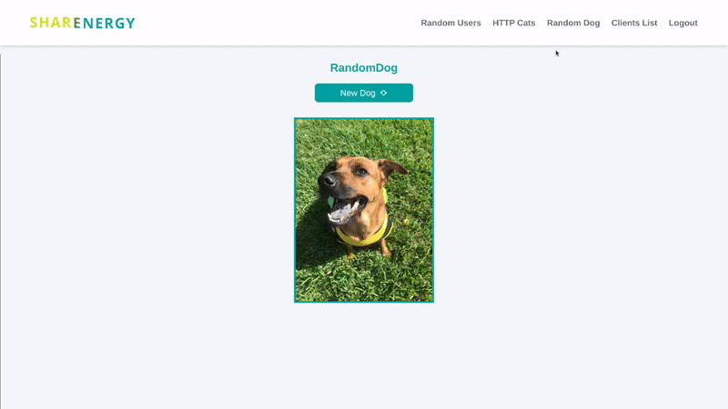
   
  Versão mobile:
   
  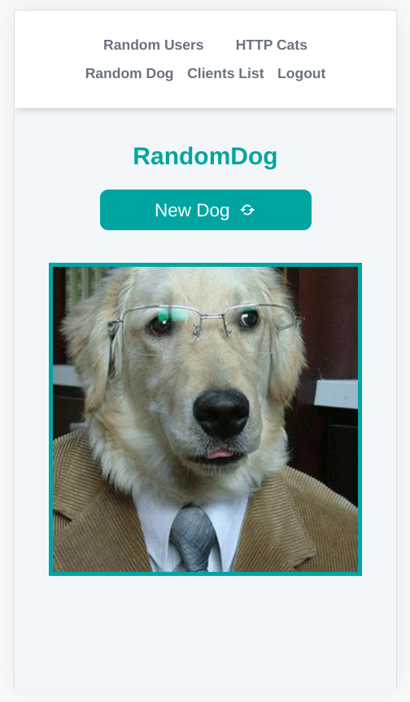
   

  
<strong>Clients List</strong>

  Na página 'Clients List', temos o frontend da lista de usuários cadastrada em nosso banco de dados mongoDB, ao iniciar a aplicação um usuário é adicionado automaticamente pelo seeder, é possível, editar e deletar usuários existente, assim como criar novos. Todas as operações do CRUD são feitas através de requisições para o o backend. OBS.: A autenticação JWT não permite criar, editar e deletar clientes com um token inválido (somente ler).

  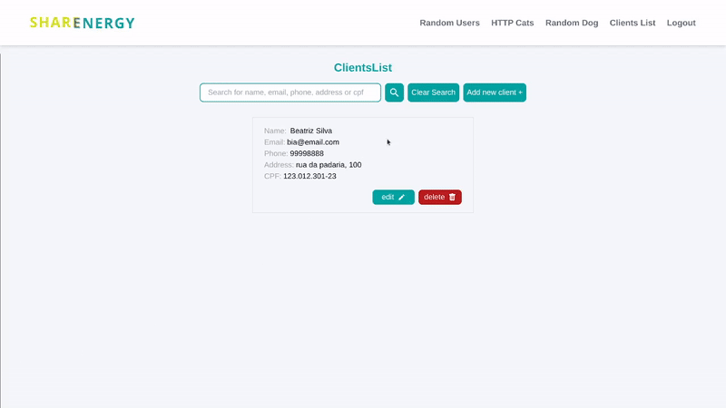
   
  Versão mobile:
   
  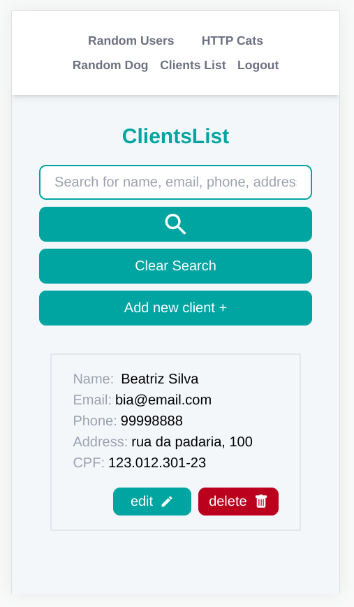
   

## As Tecnologias

  
Tecnologias e Ferramentas Utilizadas

### Frontend

  - React
  - TypeScript
  - Tailwind
  - Docker
  - Vite
  - ESLint
  - React Router
  - Figma

### Backend

  - NodeJS
  - Express
  - JavaScript
  - Mongoose
  - JWT
  - bcrypt
  - Docker
  - ESLint
  - Nodemon

### Testes Backend

  - Mocha
  - Chai
  - Sinon

### Banco de Dados

  - MongoDB
  - Docker

## Como iniciar a aplicação localmente

  
<strong>Instalação e execução com Docker</strong>

  - Fazer o clone do repositório;
  - Verificar se há o docker-compose instalado localmente na versão 1.29 ou superior, caso não, [instalar](https://docs.docker.com/compose/install/);
  - Entrar na pasta raiz, onde está localizado o docker-compose.yml
  - Verificar se as portas 3000, 3001 e 3002 estão disponíveis, pois os contêineres irão se comunicar com elas;
  - Executar ``docker-compose up --build`` e aguardar os contêineres subirem;
  - Vá até o navegador de sua preferência e acesse ``http://localhost:3000/``;
  - Pronto! Não esqueça que para o acesso é necessário entrar com o login ``desafiosharenergy`` e senha ``sh@r3n3rgy``.

